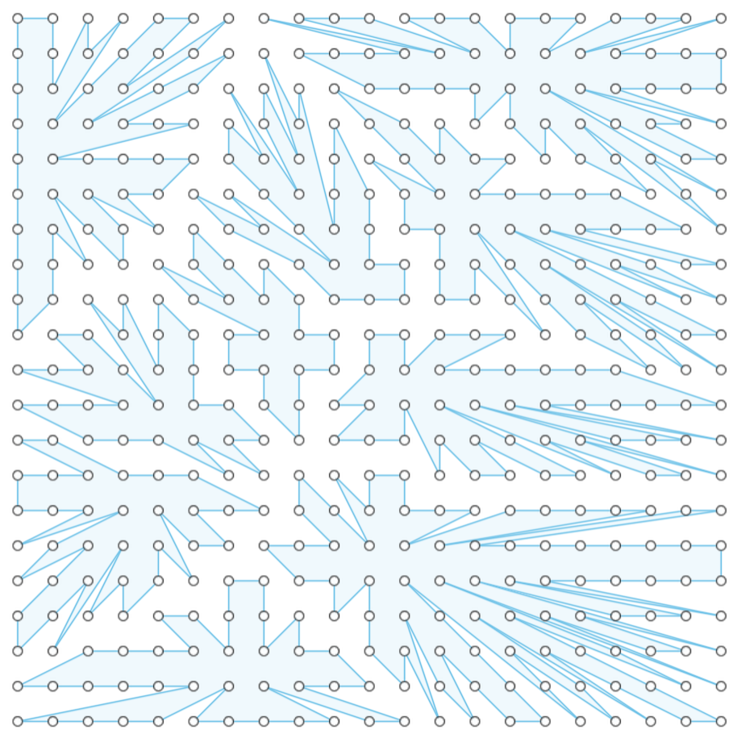

# Voronoi Pattern Generator in Fusion 360

This Fusion 360 script generates a Voronoi pattern using only built-in Python libraries, making it lightweight and easy to run without external dependencies.

## What is a Voronoi Diagram?

A Voronoi diagram partitions space into regions based on proximity to a set of seed points. Each region contains all the points that are closer to one seed than to any other. These diagrams are widely used in design, architecture, and computational geometry for creating organic and geometric patterns.

## How the Script Works

Instead of using external libraries like NumPy or SciPy, this script uses a grid-based brute-force approach to approximate Voronoi regions:

1. **Seed Point Generation**: Random seed points are scattered within a defined rectangular boundary.
2. **Grid Evaluation**: A grid of points is created across the boundary, and each point is assigned to the nearest seed.
3. **Region Mapping**: Grid points are grouped by their nearest seed to form regions.
4. **Closed Loop Construction**: Each region is sorted angularly around its seed point and connected as a closed polygon.
5. **Sketch Creation**: These polygons are drawn in a Fusion 360 sketch using lines, making them suitable for extrusion.

## Implementation Details

- **Number of Seed Points**: 10
- **Sketch Area**: 10 x 10 units
- **Grid Resolution**: 0.5 units
- **Output**: Closed polygonal regions in a sketch on the XY plane

Each region is drawn as a closed loop, enabling direct extrusion in Fusion 360 for creating 3D Voronoi-based designs.

## Author

Developed by Finny Varghese
