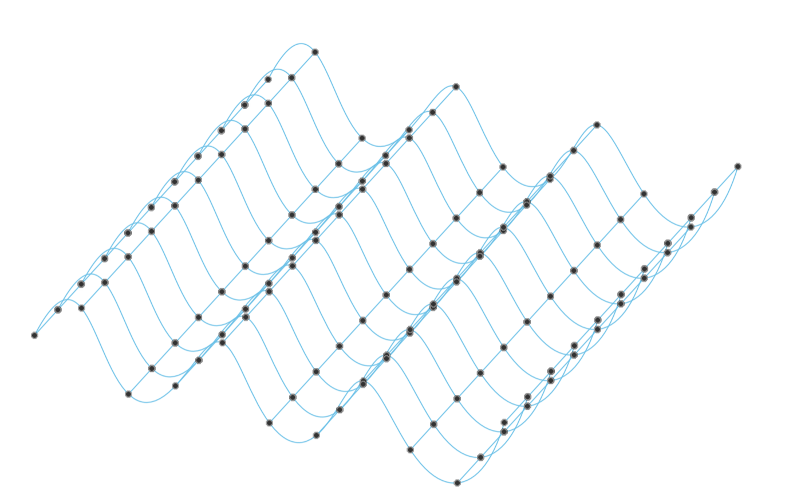

# Waveform Surface Generator for Fusion 360

This Fusion 360 script generates a sinusoidal waveform surface using parametric equations. It is ideal for creating ripple-like textures, acoustic panels, or decorative surfaces.

## Concept

The surface is based on a sinusoidal function:

    z = A * sin(kx)

Where:
- `A` is the amplitude (height of the wave),
- `k` is the frequency (number of waves per unit length),
- `x` is the horizontal position.

This equation creates a wave along the X-axis. The script evaluates this function over a grid of points on the XY plane and computes the corresponding Z values to simulate a 3D surface.

## Cartesian Grid Implementation

The script:
1. Defines a grid of points across a rectangular area.
2. Computes the Z value for each point using the sine function.
3. Connects the points using smooth fitted splines in both row and column directions to visualize the waveform.

## Parameters

- `amplitude = 1.0` – height of the wave
- `frequency = 2.0` – wave frequency
- `width = 10.0` – width of the grid
- `height = 10.0` – height of the grid
- `resolution = 1.0` – spacing between grid points

## Fusion 360 Integration

The script uses Fusion 360's API to:
- Create a sketch on the XY plane
- Generate 3D points with sinusoidal Z values
- Add smooth fitted splines to represent the waveform

## Author

Developed by Finny Varghese
